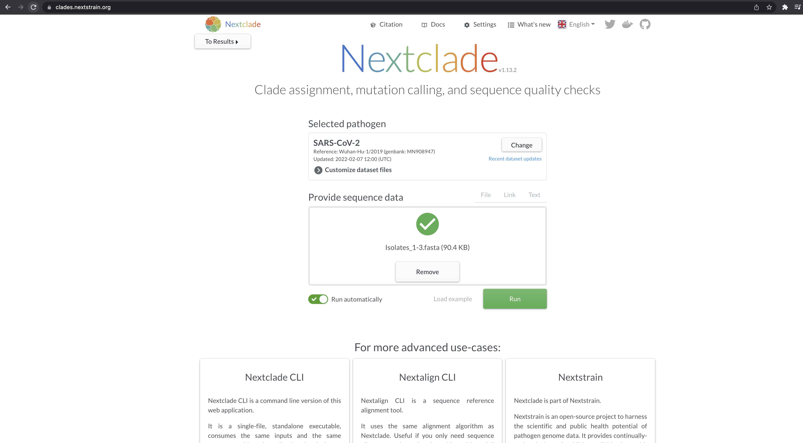
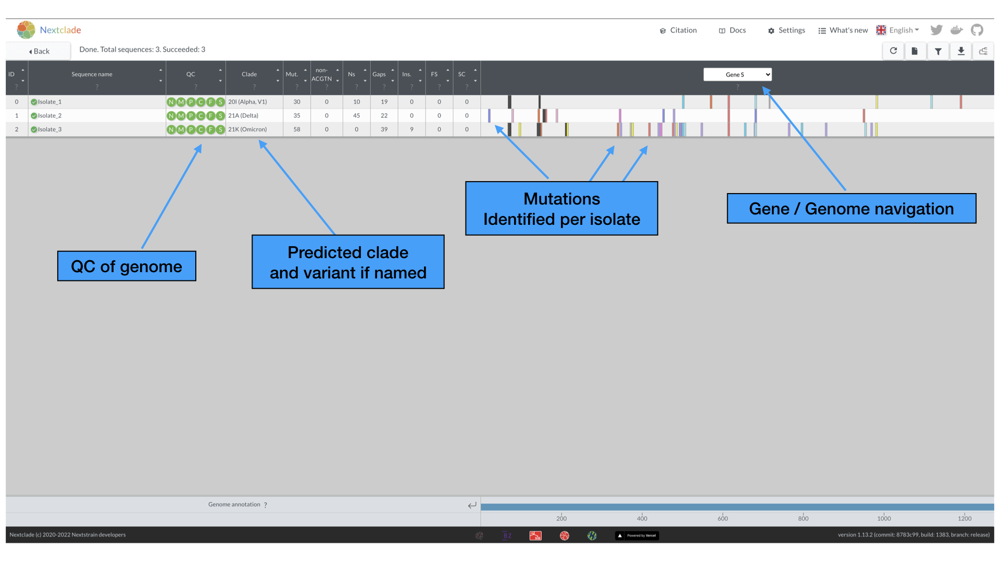
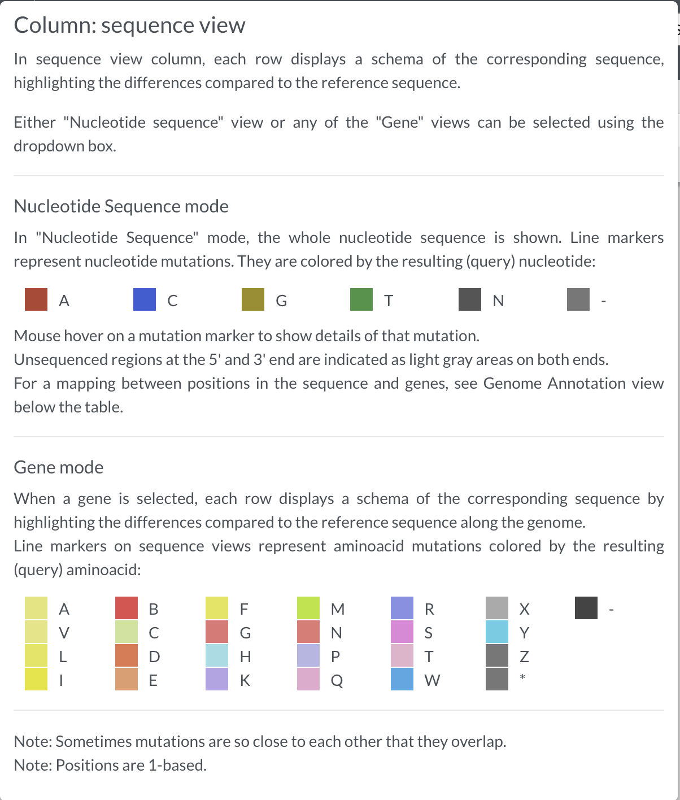
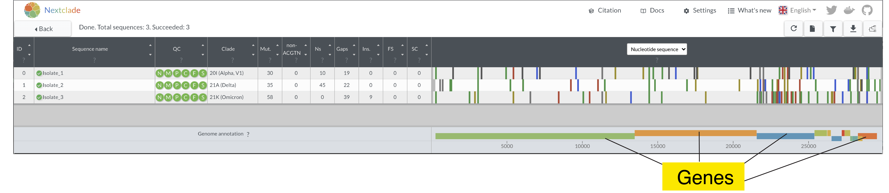
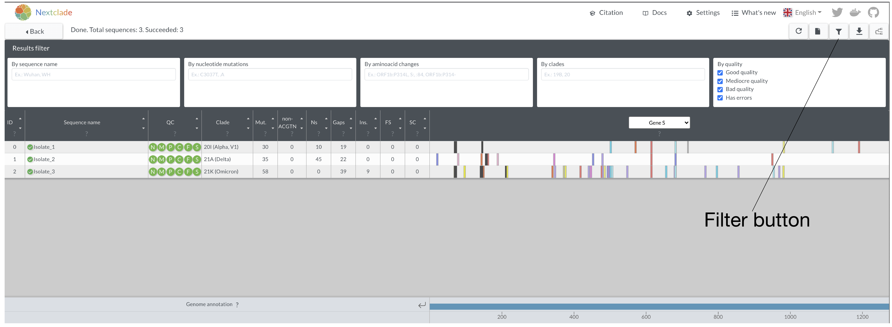
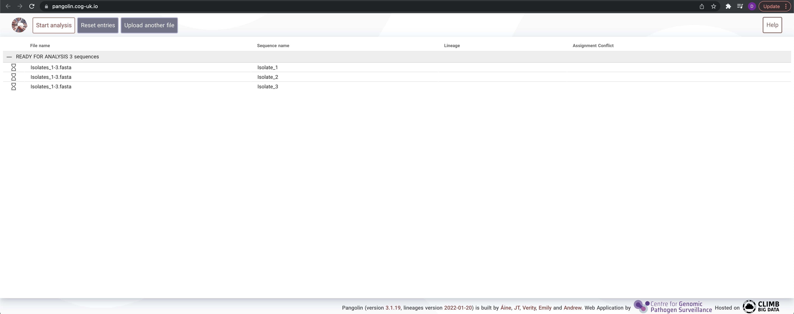
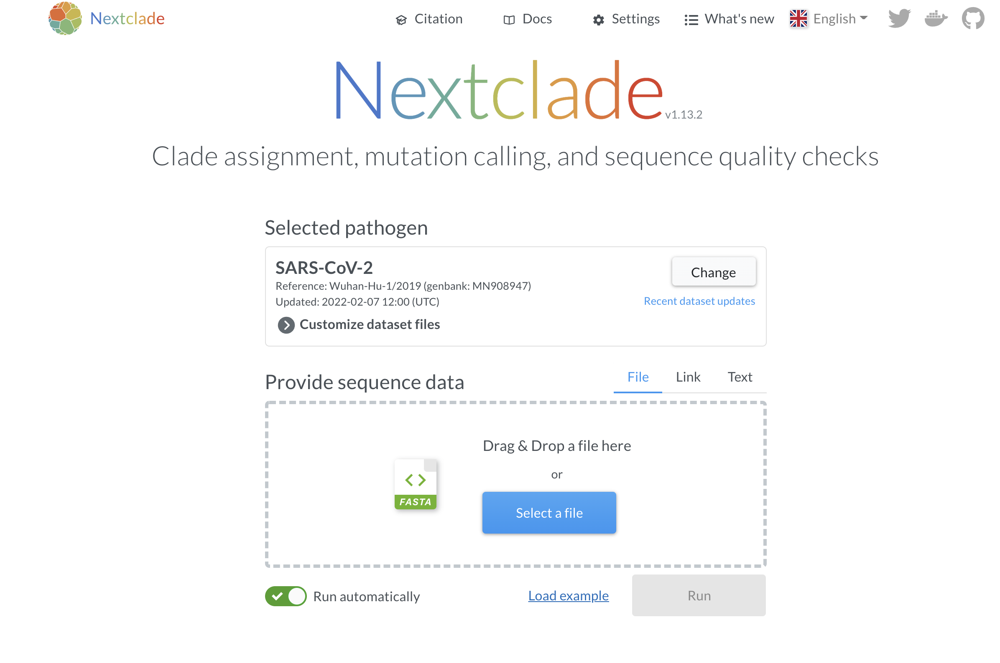
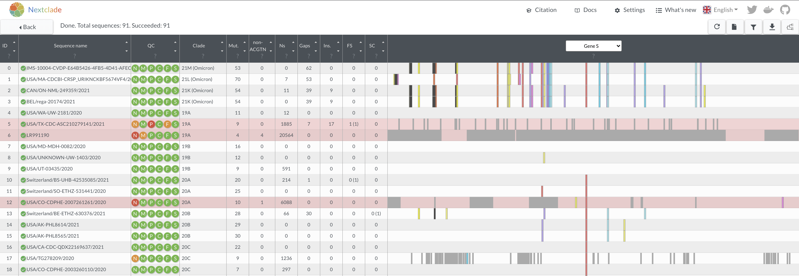

# Introduction to NGS


## Table of contents
1. [Introduction & Aims](#introduction)
2. [Looking at fasta files](#exercise1)
3. [Nextclade](#exercise2)
4. [Pangolin](#exercise3)
4. [Exploring more data in Nextclade](#exercise4)

## 1. Introduction <a name="introduction"></a>

The goal of this exercise is to provide an introduction into looking at genomes and using some web-based tools to analyze several SARS-CoV-2 genomes.


 [↥ **Back to top**](#top)

 ******
## Looking at a fasta file <a name="exercise1"></a>
Remember that a `.fasta` file has the format like the following:

```
>name_1
AGTCGCTATCG
>name_2
GGTCATCGAAC
```
Today we are going to take a look at some real data using SARS-CoV-2 genomes using the `Isolate_1-3.fasta` file.

1. Take a look at the `Isolate_1-3.fasta` using a text editor. In Windows you can use the `Windows Notepad`. If you are using a Mac, use `TextEdit`.
2. Using the `find` function in your text editor, how many '>' can you find in this file? How many genomes therefore are in this file?

*******

## Nextclade <a name="exercise2"></a>

Next, we will be using the online tool **Nextclade** to explore some basic analysis of SARS-CoV-2 genomes.

Please open the **Nextclade** tool by navigating to the website : https://clades.nextstrain.org/

***Loading fasta files into Nextclade***  
Load the fasta file called ```Isolates_1-3.fasta``` by either using the 'Select File' button or simply dragging and dropping the file into the box.



Press the Run button to begin the analysis.

***Nextclade analysis***  
After a few moments, the analysis should finish and you will be brought to the main analysis page. It should look like the following:



Here, you will see for each entry in the `Isolates_1-3.fasta` file there are a variety of analyses performed, including assessing the quality (QC) of the sequence, as well as clade and variant assignment, various metrics of genome sequence, as well as the actual mutations called against the reference genome.

We will be exploring the QC metrics in later modules, but here the green color of the various circles indicate that that these genomes are good quality and pass the Nextclade QC metrics. Hovering over each of the circles allows you to see what the metric is being evaluated.

The results table consists of the follow:
1. ***Mut.***: number of mutations with respect to the root of the reference tree
2. ***non-ACGTN***: number of ambiguous nucleotides that are not N
3. ***Ns***: number of missing nucleotides indicated by N
4. ***Gaps***: number of nucleotides that are deleted with respect to the reference sequence
5. ***FS***: Number of uncommon frame shifts (total number, including common frame shifts are in parentheses)
6. ***SC***: Number of uncommon premature stop codons (total number, including common premature stops are in parentheses)

By default, the opening page is focused on the S gene. Hover your mouse over the various mutations to see more detailed information. The various colors of the mutations are further described by hovering over the "?" just below the Gene / Genome navigation selection. We list them here also for your reference.



***Question***
1. Are our isolates classified by NextClade as a variant?

[↥ **Back to top**](#top)

***Tasks and Questions***  
1. Look at the "Nucleotide Sequence" view to get a view of the entire genomes

2. Looking at the whole genome, do you see particular areas that seem to have more mutations than others? What gene or genes are these?
3. Naviate back to the S-gene view. Let's try and find some key similarities and differences in mutations between these samples. You can either do by eye on the screen or you can use the filter icon on the top right hand side.



Here you can filter by either absolute nucleotide position, or by the relative amino acid position within the a gene. If a genome has a mutation, they will remain visible. If not, the genome will disappear from the list. While this may seem trivial when we are looking at 3 genomes, this feature is very useful if you are looking at hundreds of genomes at once and would like to know about a particular mutation.

For instance in the `By amino acid changes` type `S:614`. How many genomes remain? Why? Can you find this mutation visually?

Try `S:1118`. How many of our genomes have a mutation at this position?


Let's look at a few important mutations in the S gene and see how they compare across isolates (and in this case variants). Write down the amino acid changes (if present) for the various isolates.

| Mutation AA Position | Isolate 1 | Isolate 2 | Isolate 3 |
| ------------- |:-------------:| -----:| -----:|
| 452      |       |    |
| 484      |       |    |
| 501 |     |      |
| 681|    |     |

You can find more information about the importance of these mutations by visiting https://covariants.org/


We will be exploring and using Nextclade much more in future modules.  
[↥ **Back to top**](#top)

**********

## Pangolin lineage calling <a name="exercise3"></a>

While Nextclade can provide a classification, it uses the NextStrain lineage designations. To get the Pangolin lineage designation we will use the web portal at https://pangolin.cog-uk.io/ to quickly classify our sequences into Pango lineages.

Please do the following:
1. Go to https://pangolin.cog-uk.io/
2. Input the `Isolates_1-3.fasta` -- You should see the follow:


3. Hit the `Start analysis` button at the top. This will take a few moments.
4. The Pango lineage call is reported under the `Lineage` column when the results arrive.

What are the Pango lineage calls for the isolates?

| Isolate | Pango lineage |
| ------------- |:-------------:
| Isolate 1     |       
| Isolate 2      |     
| Isolate 3      |  

*******
## Further exploring data in NextClade <a name="exercise4"></a>

As an optional exercise if you have time:  
1. Open a new Nextclade page : https://clades.nextstrain.org/
2. Click on the `Load example` option to load a random set of genomes
  

3. Take a few moments to look over how all these different genomes look both in terms of quality and the differences in mutations. Be sure to look at other regions other than the S gene.



***Questions***  
1. Do some genomes have large gaps or many gaps? What might be the reason for this?
2. What might be some of the impacts of having lots of missing data (ie many Ns)?
