# Mycobacterium tuberculosis example dataset


## Table of contents
1. [Introduction & Aims](#introduction)
2. [Run fastQC](#exercise1)
3. [Trimming reads](#exercise2)
4. [Download Reference Genome](#exercise3)

## 1. Introduction <a name="introduction"></a>

The goal of this exercise is look at basic QC data from Illumina sequencing reads and to use a trimming tool to remove adapter sequences and poor quality bases. Our dataset are two *M. tuberculosis* samples that have been sequenced via Illumina paired-end. We will be using this data for this module and the next to focus on the basics of data QC and for mapping reads to a reference genome.

### We will

- [X] Learn how to run `fastqc` on Illumina reads
- [X] Use `multiqc` to combine and visualize multiple `fastqc` reports
- [x] Learn how to create a new `conda` environment
- [x] Use `trim_galore` to trim Illimina fastq data

First move into the TB dataset folder:
```bash
cd TB_module
```
If you list the contents of this directory `ll` it should appear like the following:
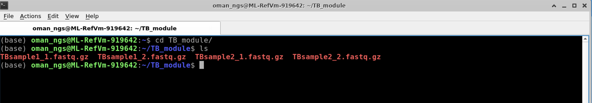

We are working with two samples that have been sequenced with Illumina via paired-end sequencing. Therefore, each sample has a forward and reverse read. The forward read is usually denoted by  `SAMPLE-NAME_1.fastq.gz` and the reverse is usually denoted by `SAMPLE-NAME_2.fastq.gz`

 [↥ **Back to top**](#top)

 ******

## Run FASTQC <a name="exercise1"></a>

The program `fastqc` is widely used to assess the quality metrics of Illumina sequencing data. Here we will be running `fastqc` on both of the TB samples before and after we perform read and adapter trimming.

As with nearly all programs you can get see how to run the program by either just typing the program name, in this case `fastqc` or typing `fastqc -h`.

`fastqc` in default mode simply expects fastq files after the program name like so : `fastqc SAMPLE_1.fastq.gz`. We have to run the program for each the forward and the reverse reads per sample -- so a total of 4 files. Thankfully we can list all the files at one time.

Run `fastqc` on each of the files:
```bash
fastqc TBsample1_1.fastq.gz TBsample1_2.fastq.gz TBsample2_1.fastq.gz TBsample2_2.fastq.gz
```
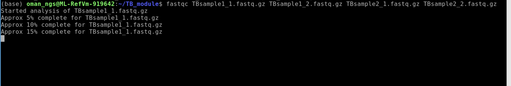

When this has finished, we are now going to use a related program called `multiqc` to combine and visualize the output of `fastqc`.

Run `multiqc` here and don't forget the period at the end of this command! The period simply designates run "here" in the current folder
```bash
multiqc .
```
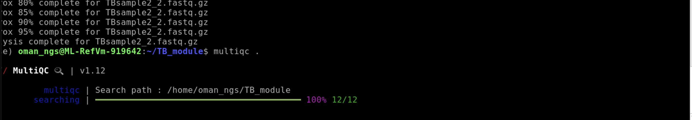

Type `ls` to see all the new files we have generated
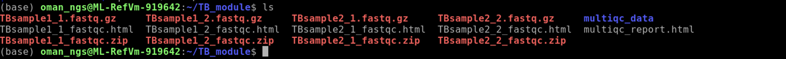

| File type | Description |
| ------------- |:-------------:
| .fastq.gz     | original fastq data
| _fastqc.zip      | data folder for output of fastqc compressed as zip file
| _fastqc.html      | fastqc results per file that can be viewed in web browser
| multiqc_data     | multiqc combines the data across all `fastqc` and stores them in this folder
| multiqc_report.html     | results of multiqc that can be viewed in web browser

The main output for us to view from `multiqc` is the `multiqc_report.html` file. We can either open this file by using the file browser and clicking on the html file, or we can open a web browser from the command line.

To view results type:
```bash
firefox multiqc_report.html
```
This will open firefox and load the file into an interactive session.

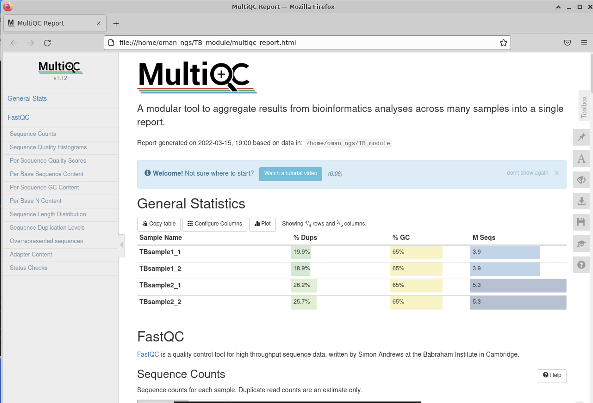

There are many different statistics and QC analysis that is output by `fastqc / multiqc`. Here we are going to highlight the most important ones, but I encourage you to look over all of them and use the nice built-in descriptions to learn more.

### **General Statistics Table**

The first is the nice **General Statistics** table at the very start. This is s nice summary per file (remember it is a separate file for both forward and reverse reads per sample)
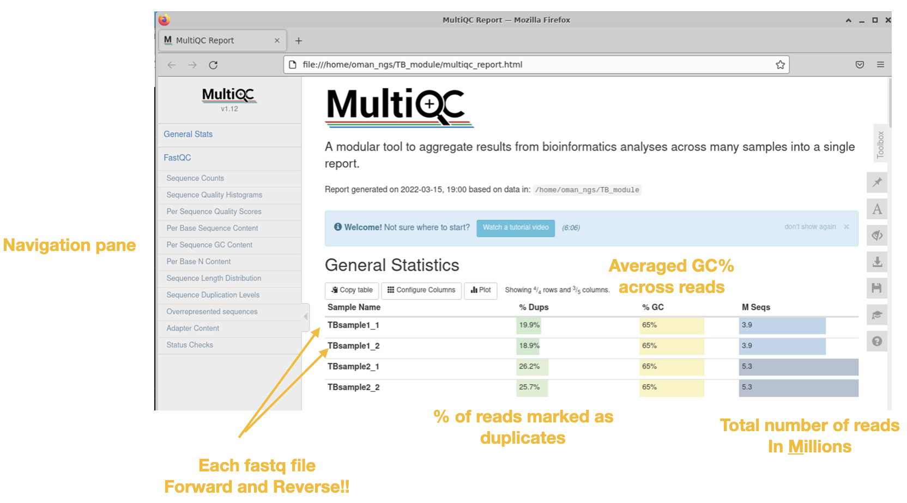

### **Sequence quality histograms**
**This is THE most important plot.** This plot shows you the average quality score per base across summarized across the read length.

Sequences with good quality scores across the read are colored green.

Sequences with poor quality scores across the read are colored red.

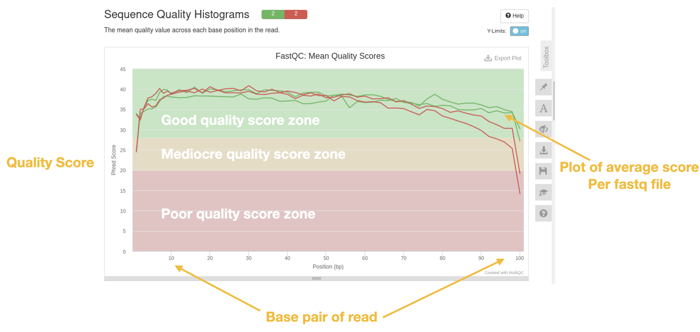

##### *Questions*
1. Which sample has good quality scores?
2. Which sample has bad?
3. What is happening at the end of the reads in terms of quality?

A related plot is the per sequence quality scores histogram which gives the total number of reads that have a given mean quality score.

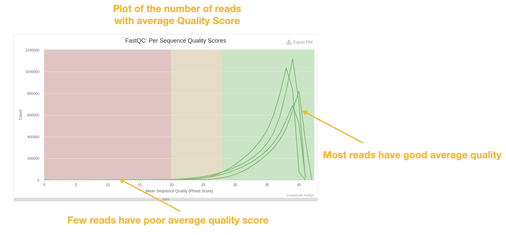

### GC histogram
Another important plot is to look at the mean GC content of the reads. This plot often gives us an indication of whether or not we have contamination. If you are sequencing a single organism in your sample(s), the GC content should follow a normal 'bell' distribution. If there happened to be contaminating DNA from another organism it will likely have a slightly different mean GC and this shows up a 'bump' in the distribution.
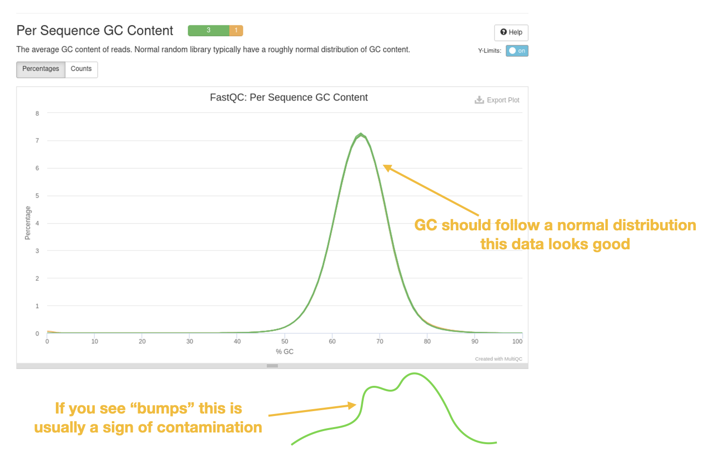


There are other useful plots and analyses that are in the  fastQC / multiQC report. I encourage you to look at these and explore the data!


**`Control+c` will allow you to close firefox at the terminal when done viewing the report**

[↥ **Back to top**](#top)
*******


 ******
## Trimming reads with trim_galore <a name="exercise2"></a>

Next, we will be using the  tool **trim_galore** to trim (ie remove) poor quality data and contaminating adapter sequences. `trim_galore` takes about 10 minutes to finish per dataset.

`Trim Galore` is a tool that runs the program `cutadapt` and `fastQC`. You can find more information about these tools here:
1. `Trim Galore` : <https://github.com/FelixKrueger/TrimGalore/blob/master/Docs/Trim_Galore_User_Guide.md>
2. `cutadapt`: <https://cutadapt.readthedocs.io/en/stable/>

### Using `conda` to install and download tools <a name="conda"></a>
First we will use `conda` to install the `trim_galore` program. `conda` is a package management tool that allows one to create different "environments" and takes the pain out of downloading software. I have already installed `conda` but you can find the details how I did this here : <https://docs.conda.io/en/latest/miniconda.html>

Please run:
```bash
conda create --yes -n qc -c bioconda -c conda-forge python=3.8 trim-galore fastqc multiqc
```
This creates a new environment called 'qc' and installs the programs `trim_galore` , `fastqc`, `multiqc` and `python3.8`

You activate the new environment with the command:

```bash
conda activate qc
```
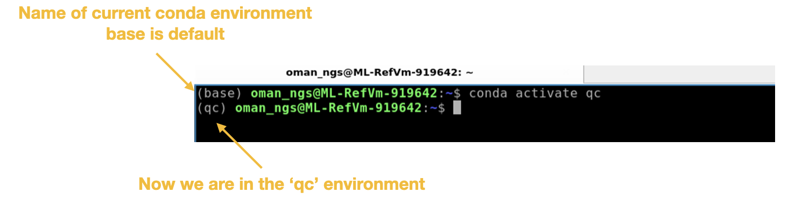

Now we are able to use `trim_galore` to process the fastq file for each of the TB samples.

**Run trim_galore on Sample 1**
```bash
trim_galore --cores 4 --paired --fastqc TBsample1_1.fastq.gz TBsample1_2.fastq.gz
```
This command has several options that we used:  
`--cores 4` : use 4 CPUs (the max on our VMs) so that it runs faster  
`--paired` : let's the program know we have paired-end data  
`--fastqc` : automatically runs `fastQC` when finished

**!!! This step is going to take around 10 minutes to finish. While waiting please go to [Download Reference Genome](#exercise3) section.**

When finished `trim_galore` produces the following files **per fastq file**:

| File type | Description |
| ------------- |:-------------:
| `_val_1.fq.gz` or `_val_2.fq.gz`      | trimmed fastq file
| _trimming_report.txt     | summary output of `trim_galore` command
| _val_1_fastqc.zip      | data folder for output of fastqc compressed as zip file
| _val_1_fastqc.html     | fastqc results from trimmed fastq that can be viewed in web browser


### Now run `trim_galore` for the second sample:
```bash
trim_galore --cores 4 --paired --fastqc TBsample2_1.fastq.gz TBsample2_2.fastq.gz
```
**This will take around 10 minutes to complete.**  

Use this time to look over the `fastQC` html files or the `multiQC` html files we have already generated and see if there are any questions.

Once the command above has finished use `ls` to see all the files we have generated:
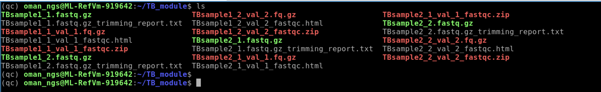

At this point we should have `fastQC` data for our original fastq files as well as the trimmed reads.

### Run multiqc to collate all fastQC reports for original and trimmed reads
```bash
multiqc -f .
```
`-f` : overwrites the previous `multiqc` report

### Open new report with firefox
```bash
firefox multiqc_report.html
```
**Remember `Control+c` will allow you to close firefox at the terminal when done viewing**

### Comparing the dataset
Look through the new multiQC report to see the difference trimming has made (particularly for TBSample2 data)
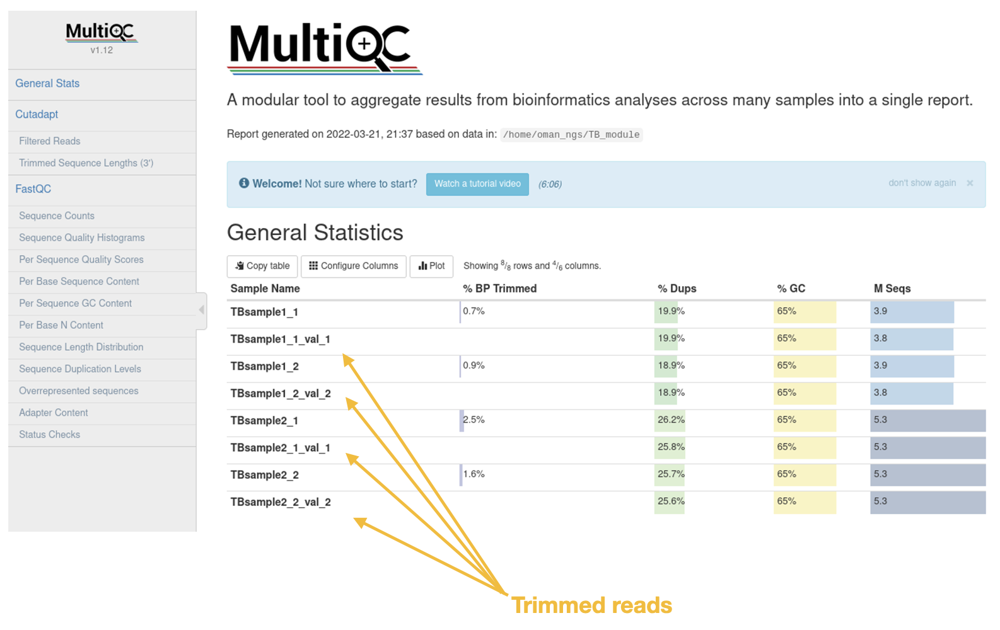


##### *Questions*
1. Look at the Sequence Count table. Are there less reads in the trimmed datasets compared to the original data?
2. Was a large percentage of reads removed or trimmed overall?
3. How did trimming effect the mean sequence quality? Does the data look to be higher quality now?


[↥ **Back to top**](#top)
## Download TB reference genome <a name="exercise3"></a>

The reference genome Mycobacterium tuberculosis H37Rv can be found here :
<https://www.ncbi.nlm.nih.gov/nuccore/AL123456.3/>

Follow the steps below for downloading the GenBank genome file:
### Step 1   
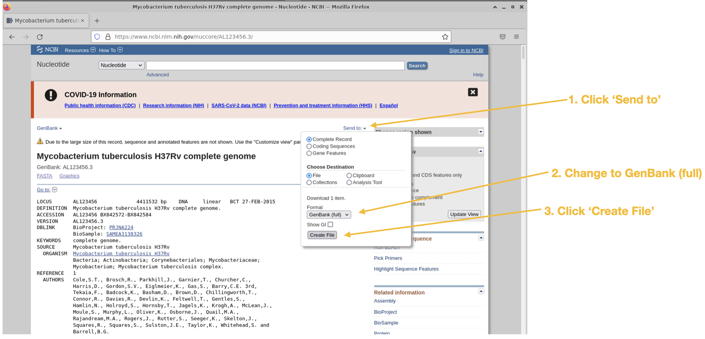  
### Step 2
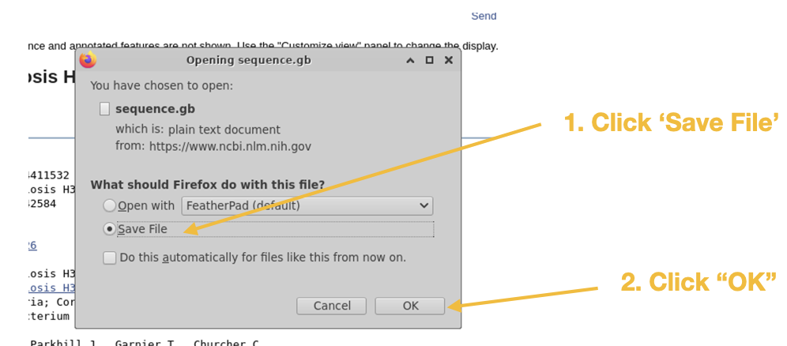  
### Step 3
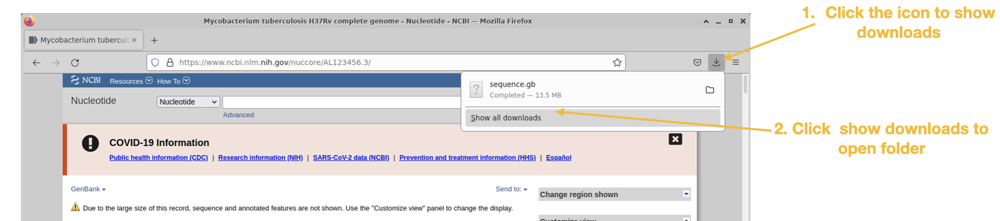
### Step 4
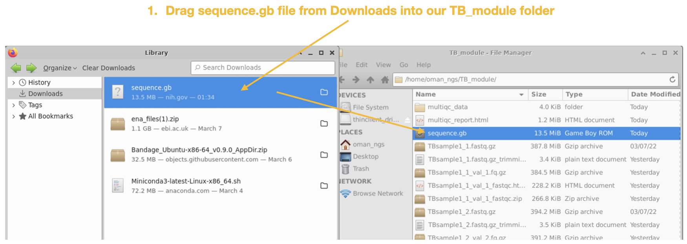
### Step 5
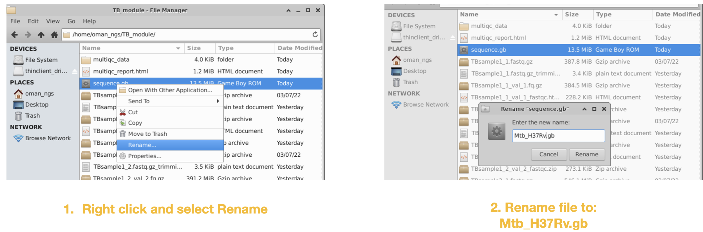

We will be using this reference genome file for our upcoming mapping module.

[↥ **Back to top**](#top)
