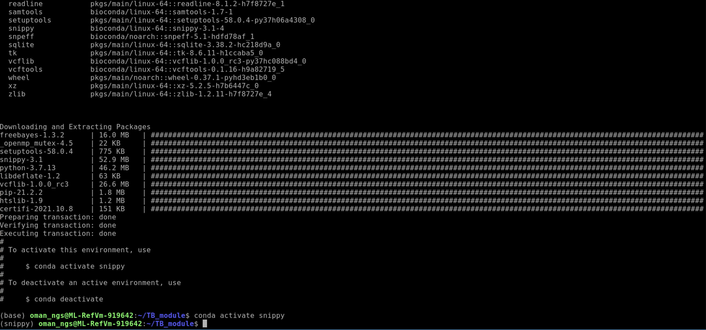
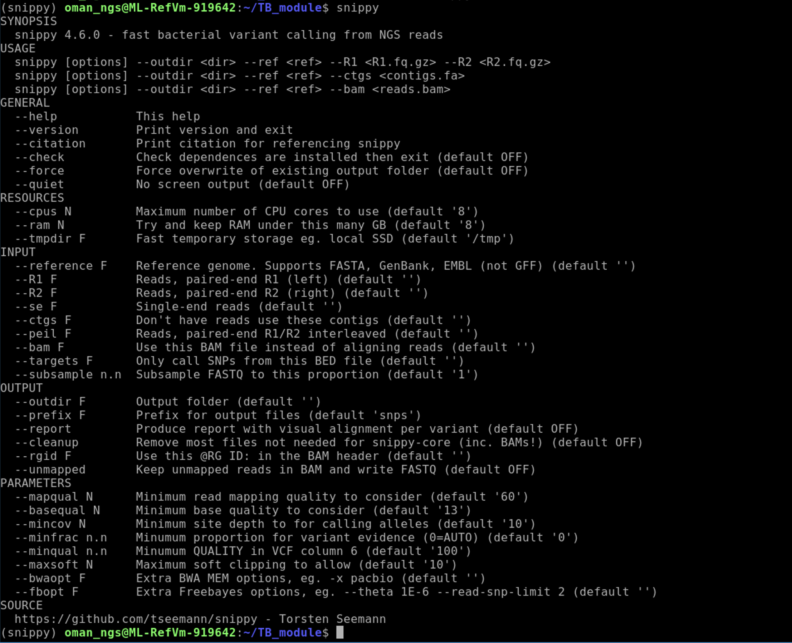
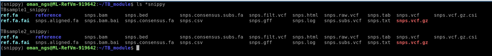
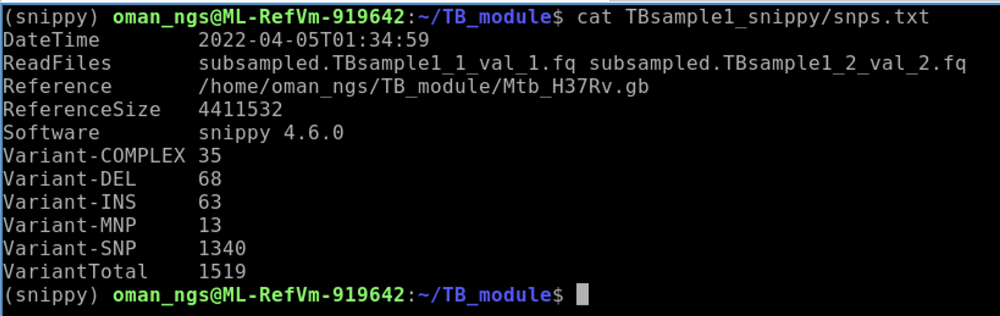

# Mycobacterium tuberculosis example dataset


## Table of contents
1. [Introduction & Aims](#introduction)
2. [Run Snippy](#exercise1)
3. [Looking at SNPs](#exercise2)
4. [Looking for resistance SNPs](#exercise3)

## 1. Introduction <a name="introduction"></a>

The goal of this exercise is look map short reads (Illumina) to a reference genome and call variants. Our dataset are two *M. tuberculosis* samples that have been sequenced via Illumina paired-end. We will be using the trimmed reads from the previous module as input for the mapping.

### We will

- [X] Create a new `conda` environment for `snippy`
- [X] Use `snippy` to map and call variants for each dataset
- [x] Look at SNPs


## Map and call variants using `snippy` <a name="exercise1"></a>
First move into the TB dataset folder:
```bash
cd TB_module
```

#### We need to install `snippy` by creating a new conda environments

Install `mamba` by using the following command:
```bash
conda install -y -c conda-forge mamba
```
`-y` : automatically proceeds with downloading packages  
`-c conda-forge`: adds conda-forge channel
`mamba` at the end are the names of the packages we are downloading `mamba`

### If you previously installed the snippy environment please remove it here first:
```bash
conda remove --name snippy --all
```
Now we are going to use `mamba` to install `snippy`
```bash
mamba create --name snippy -c conda-forge -c bioconda snippy==4.6 snpeff==5.0 bcftools==1.10 vt==0.57721
```
`mamba` is a faster alternative to `conda` that sometimes works a bit better for some installations. It works in exactly the same way as `conda`.  

`mamba create` : command that creates a new environment  
`-c conda-forge`: adds conda-forge channel  
`-c bioconda`: adds bioconda channel  
`snippy==4.6 snpeff=5.0 bcftools=1.10 vt==0.57721` : installs specific packages and versions

Once it has finished installing you can now activate the environment by typing:
```bash
conda activate snippy
```

This should do the trick, and everything should work now.


Check snippy is installed properly and to get an idea of how to run the program:
```bash
snippy -h
```


## 2. Run `snippy` to map reads to reference and call variants <a name="exercise2"></a>

We are going to use `snippy` which is a very popular pipeline for mapping and calling variants for bacterial genomes.  
You can learn more about the pipeline here : https://github.com/tseemann/snippy  

Let's run snippy on the first TB sample:
```bash
snippy --cpus 4 --outdir TBsample1_snippy --ref Mtb_H37Rv.gb --R1 TBsample1_1_val_1.fq.gz --R2 TBsample1_2_val_2.fq.gz --subsample 0.5
```
`--cpus 4` : run using 4 CPUs (the max number we have on the VMs). Default is 8.  
`--outdir` : name the output directory  
`--ref` : reference genome file in GenBank or fasta format  
`--R1` : Forward read files (remember we are using the trim_galore output files)  
`--R2` : Reverse read files (remember we are using the trim_galore output files)  
`--subsample` : percentage to subsample reads. In this case we look at 0.5 (half) to speed things up. (You don't have to do this with your actual data).

`snippy` will take a few minutes to complete. There will be quite a bit of output on the terminal -- and that is OKAY!

When finished if you run:
```bash
ll TBsample1_snippy
```


### Now modify the command to run date for TBsample2.  
How do you need to change the above `snippy` command so that you use that data?  

Set `--outdir TBsample2_snippy`. What read data (`--R1` and `--R2`) do we need to add?

After you have run both `snippy` commands you should see the following files is you run:
```bash
ls *snippy
```

You should see both datasets that have the same files.

## Looking at SNPs <a name="exercise2"></a>
There are many different files produced by `snippy`.

## Output Files

Extension | Description
----------|--------------
.tab | A simple [tab-separated](http://en.wikipedia.org/wiki/Tab-separated_values) summary of all the variants
.csv | A [comma-separated](http://en.wikipedia.org/wiki/Comma-separated_values) version of the .tab file
.html | A [HTML](http://en.wikipedia.org/wiki/HTML) version of the .tab file
.vcf | The final annotated variants in [VCF](http://en.wikipedia.org/wiki/Variant_Call_Format) format
.bed | The variants in [BED](http://genome.ucsc.edu/FAQ/FAQformat.html#format1) format
.gff | The variants in [GFF3](http://www.sequenceontology.org/gff3.shtml) format
.bam | The alignments in [BAM](http://en.wikipedia.org/wiki/SAMtools) format. Includes unmapped, multimapping reads. Excludes duplicates.
.bam.bai | Index for the .bam file
.log | A log file with the commands run and their outputs
.aligned.fa | A version of the reference but with `-` at position with `depth=0` and `N` for `0 < depth < --mincov` (**does not have variants**)
.consensus.fa | A version of the reference genome with *all* variants instantiated
.consensus.subs.fa | A version of the reference genome with *only substitution* variants instantiated
.raw.vcf | The unfiltered variant calls from Freebayes
.filt.vcf | The filtered variant calls from Freebayes
.vcf.gz | Compressed .vcf file via [BGZIP](http://blastedbio.blogspot.com.au/2011/11/bgzf-blocked-bigger-better-gzip.html)
.vcf.gz.csi | Index for the .vcf.gz via `bcftools index`)

Let's take a look at a summary file to see how many variants were called in total:
```bash
cat TBSample1_snippy/snps.txt
```

How many variants total were called against for this sample?

### Look at the `snps.txt` for TBSample2.
```bash
cat TBSample2_snippy/snps.txt
```

Which TB dataset has more variants called?


### Looking at the `snps.html` file
One of the most useful files for us to look at is the `snps.html` file. This file will list each of the mutations found and describe what gene and what type of mutation -- for instance whether it is a synonymous or non-synonymous mutation. If a non-synonymous mutation it will list the amino acid difference and the gene effected.

Open the following file:
```bash
firefox TBsample1_snippy/snps.html
```

## Columns in the TAB/CSV/HTML file formats
Name | Description
-----|------------
CHROM | The sequence the variant was found in eg. the name after the ```>``` in the FASTA reference
POS | Position in the sequence, counting from 1
TYPE | The variant type: snp msp ins del complex
REF | The nucleotide(s) in the reference
ALT | The alternate nucleotide(s) supported by the reads
EVIDENCE | Frequency counts for REF and ALT

If you supply a Genbank file as the `--reference` rather than a FASTA
file, Snippy will fill in these extra columns by using the genome annotation
to tell you which feature was affected by the variant:

Name | Description
-----|------------
FTYPE | Class of feature affected: CDS tRNA rRNA ...
STRAND | Strand the feature was on: + - .
NT_POS | Nucleotide position of the variant withinthe feature / Length in nt
AA_POS | Residue position / Length in aa (only if FTYPE is CDS)
LOCUS_TAG | The `/locus_tag` of the feature (if it existed)
GENE | The `/gene` tag of the feature (if it existed)
PRODUCT | The `/product` tag of the feature (if it existed)
EFFECT | The `snpEff` annotated consequence of this variant (ANN tag in .vcf)

## Variant Types

Type | Name | Example
-----|------|-------------
snp  | Single Nucleotide Polymorphism |  A => T
mnp  | Multiple Nuclotide Polymorphism | GC => AT
ins  | Insertion | ATT => AGTT
del  | Deletion | ACGG => ACG
complex | Combination of snp/mnp | ATTC => GTTA

# 3. Looking for resistance mutations <a name="exercise3"></a>

Let's look for a few well known resistance mutations in these datasets.

#### Rifampin reseistance
A primary drug for treating TB is rifampin. One of the main genes that has mutations that confers resistance to rifampin is rpoB. Let's take a look to see if we have any mutations in rpoB within our two samples.

```bash
grep 'rpoB' TBsample1_snippy/snps.tab
grep 'rpoB' TBsample2_snippy/snps.tab
```
`grep` is the command to search within a file  
Here, `rpoB` after grep is the search terms and then we follow it by the file we wish to search.


Does one sample have more mutations than the other?

One particular mutation in rpoB that is known to confer resistance to rifampin is the S640L mutation. Does one of our samples have this mutation?

### Isoniazid resistance

Take a look at this paper here: https://academic.oup.com/jid/article/182/6/1788/916586?login=false

What gene and what mutation within that gene are typical for isoniazid resistance with TB?

Use `grep` to search for this gene within the `TBsample1_snippy/snps.tab` and `TBsample2_snippy/snps.tab`


### Based on these findings, which TB sample(s) are resistant and which are sensitive?
