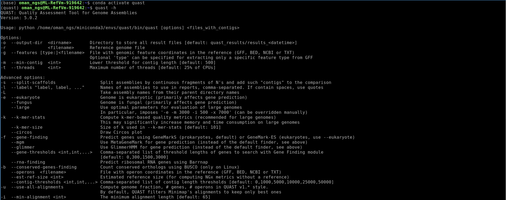
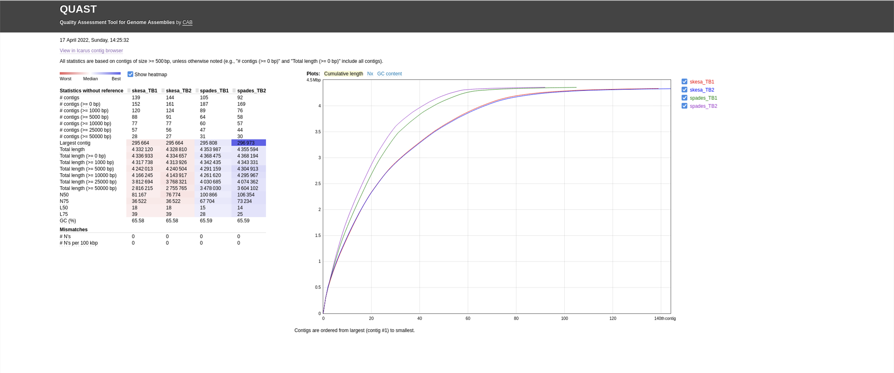

# Bacterial genome assembly using Mycobacterium tuberculosis example dataset


## Table of contents
1. [Introduction & Aims](#introduction)
2. [Run Quast](#exercise1)
3. [Looking at SNPs](#exercise2)
4. [Commands for running assemblies](#exercise3)

## 1. Introduction <a name="introduction"></a>

The goal of this exercise is to de novo assemble bacterial genomes uses `SKEASA` and `Spades`. Our dataset are two *M. tuberculosis* samples that have been sequenced via Illumina paired-end. We will be using the trimmed reads from the previous module as input for the mapping.

### We will

- [X] Compare assembly methods using `quast`
- [X] Use `prokka` to annotate genomes
- [x] Learn the assembly commands for SKESA and Spades


## Compare assemblies using Quast <a name="exercise1"></a>
First move into the TB dataset folder:
```bash
cd TB_module
```

#### We need to install `Quast` by creating a new conda environments

We will be using a program called Quast to assess the quality of assemblies : https://github.com/ablab/quast  

Install `mamba` by using the following command:
```bash
mamba create -n quast -y -c conda-forge -c bioconda quast
```
`mamba create` : command that creates a new environment
`-n quast` : create new environment called quast
`-c conda-forge`: adds conda-forge channel  
`-c bioconda`: adds bioconda channel  
`quast` : installs quast package

Once it has finished installing you can now activate the environment by typing:
```bash
conda activate quast
```


Check snippy is installed properly and to get an idea of how to run the program:
```bash
quast -h
```

#### Run quast on our assemblies:
```bash
quast -l skesa_TB1,skesa_TB2,spades_TB1,spades_TB2 skesa_TBsample1.fasta \
 skesa_TBsample2.fasta spades_TBsample1/contigs.fa spades_TBsample2/contigs.fa
```

This should do the trick, and everything should work now.





## 2. Run `prokka` to annotate genomes <a name="exercise2"></a>

#### First we need to create a new environment and install `prokka`:
```bash
mamba create -n annotate -c conda-forge -c bioconda -c defaults prokka   
coda activate annotate
```

#### Now run `prokka`
```bash
prokka --cpus 4 --proteins Mtb_H37Rv.gb --outdir skesa_TB1 --prefix TB1_skesa skesa_TBsample1.fasta
```

# 3. Commands for running bacterial genome assembly <a name="exercise3"></a>

## You do **not** need to run these commands! They are here for informational purposes.

Two very popular bacterial genome assembly programs are `SKESA` and `Spdaes`. A popular tool for running spades assemblies is called `shovill` which is what we are using here.

You can find more information here:  

`SKESA` : https://github.com/ncbi/SKESA  
`Shovill` : https://github.com/tseemann/shovill

#### First we install the programs in a new conda environment:
```bash
mamba create -n assembly -c bioconda -c conda-forge skesa shovill   
conda activate assembly
```
#### Run the `skesa` assembler : ~20 minutes per dataset
```bash
skesa --reads TBsample1_1_val_1.fq.gz,TBsample1_2_val_2.fq.gz --cores 4 --memory 8 > skesa_TBsample1.fasta   
skesa --reads TBsample2_1_val_1.fq.gz,TBsample2_2_val_2.fq.gz --cores 4 --memory 8 > skesa_TBsample2.fasta
```

#### Run `shovill` aka `spades` assembler : ~35 minutes per dataset
```bash
shovill --outdir spades_TBsample1 --R1 TBsample1_1_val_1.fq.gz --R2 TBsample1_2_val_2.fq.gz   
shovill --outdir spades_TBsample2 --R1 TBsample2_1_val_1.fq.gz --R2 TBsample2_2_val_2.fq.gz
```
