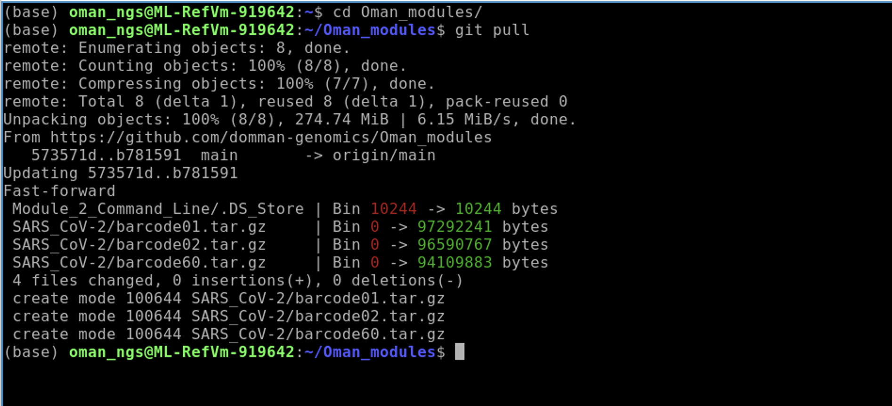
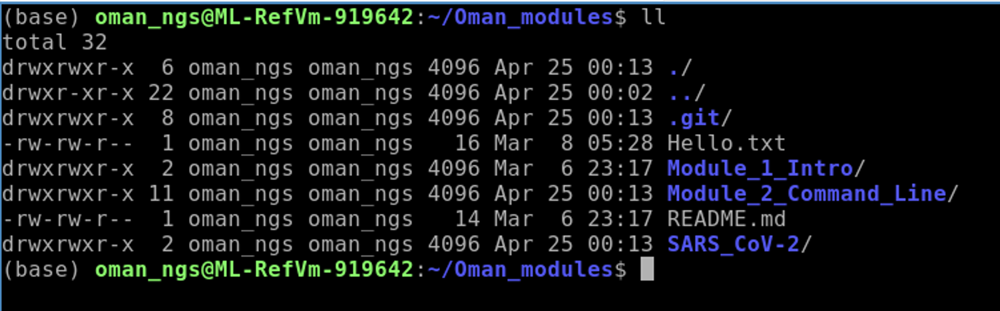
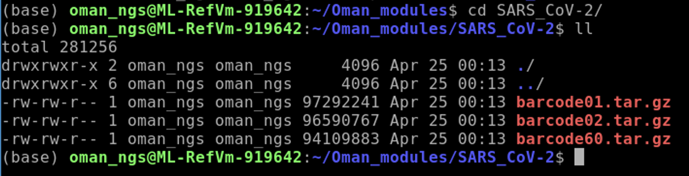
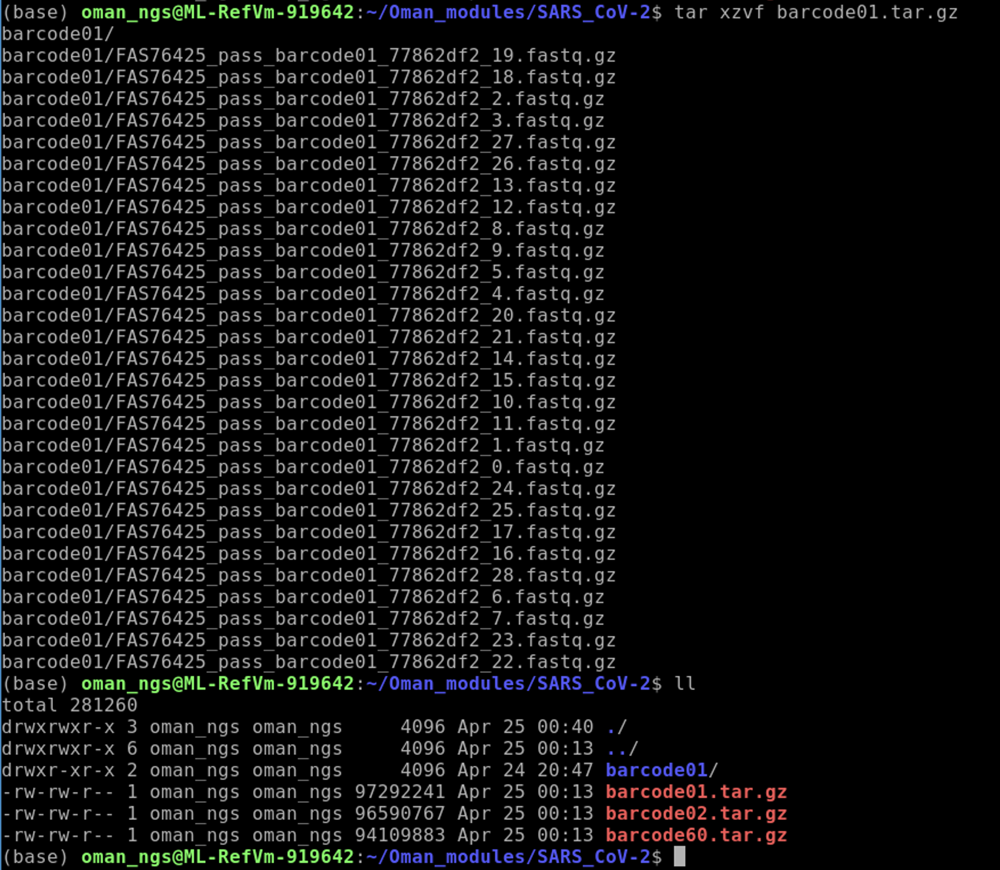
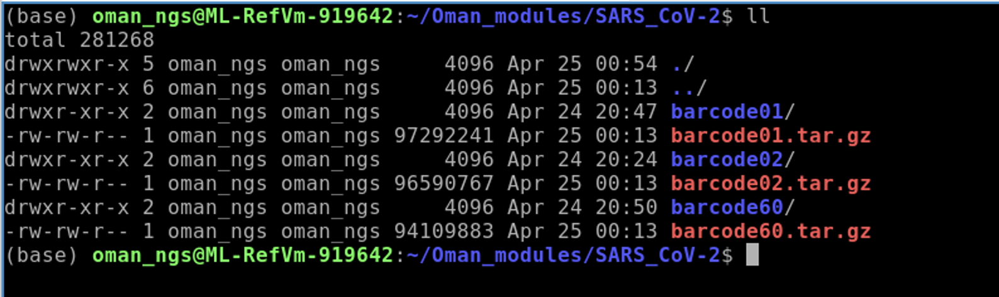

## Table of contents
1. [Introduction & Aims](#introduction)
2. [Run Quast](#exercise1)
3. [Looking at genomes](#exercise2)
4. [Commands for running assemblies](#exercise3)

## 1. Introduction <a name="introduction"></a>

In this module, we are going to work through how to generate SARS-CoV-2 consensus genomes from Oxford Nanopore data. The most popular pipeline for this is called ARTIC.

You can find more information here:  

`ARTIC` : https://github.com/artic-network/fieldbioinformatics


### We will

- [X] Use `git` to pull data from a github account
- [X] Use `tar` to uncompress files and folders
- [X]
- [x]

#### First we need to download the SARS-CoV-2 files:

```bash
cd Oman_modules
git pull
```


Check to see we now have the `SARS_CoV-2 folder`:
```bash
ll
```


#### Now move into the `SARS_CoV-2` folder to use `tar` to uncompress the files:
```bash
cd SARS_CoV-2
ll
```
You will see that there are three barcode files that end in `.tar.gz`. This means these are folders that are gzipped (.gz) or compressed. We need to uncompress them for us to use them.   


#### Use `tar` to uncompress:

```
tar xzvf barcode01.tar.gz
ll
```
`tar [options] [compressed-file] [file or directory to be compressed]` :  
`-x` : Extract (decompress)  
`-c` : compress  
`-z` : zip, tells tar command to create or uncompress tar file using gzip  
`-v` : Displays Verbose Information (print what is happening to the screen)  
`-f` : creates archive with given filename


`tar xzvf [compressed file]` is standard way to uncompress  

To compress a folder use similar command:   
`tar czvf [<file_name>.tar.gz] [file or folder]`




You should see the `barcode01` folder now.

#### Use the `tar` command to uncompress the other two barcode file
 After, you will have the following three barcode folders:
 


## Install the ARTIC Bioinformatics<a name="exercise1"></a>
A very popular pipeline for processing SARS-CoV-2 nanopore sequencing data is ARTIC. They put out an SOP for running the pipeline back in 2020, and it is still quite useful to follow:

https://artic.network/ncov-2019/ncov2019-bioinformatics-sop.html   

It is always a good idea to keep `conda` and `mamba` up to date, so we will first run:

```bash
conda update conda
mamba update mamba

```
We will follow the directions to install ARTIC from here:


#### We need to install `Quast` by creating a new conda environments

We will be using a program called Quast to assess the quality of assemblies : https://github.com/ablab/quast  

Install `mamba` by using the following command:
```bash
mamba create -n quast -y -c conda-forge -c bioconda quast
```
`mamba create` : command that creates a new environment
`-n quast` : create new environment called quast
`-c conda-forge`: adds conda-forge channel  
`-c bioconda`: adds bioconda channel  
`quast` : installs quast package

Once it has finished installing you can now activate the environment by typing:
```bash
conda activate quast
```


Check quast is installed properly and get an idea of how to run the program:
```bash
quast -h
```
This should do the trick, and everything should work now.


#### Run quast on our assemblies:

Quast usage is as follows:
`quast [options] <contig files>`

Contig files are the `.fasta` or `.fa` files produced by assembly programs   

```bash
quast -l skesa_TB1,skesa_TB2,spades_TB1,spades_TB2  skesa_TBsample1.fasta skesa_TBsample2.fasta spades_TBsample1_contigs.fa spades_TBsample2_contigs.fa
```


`-l` : you can rename what the assembly dataset is called here. We do this to make it easier when we are looking at the results instead of long names  

##### Use firefox to look at the output files:
```bash
firefox quast_results/latest/report.html
```

There are a number of useful metrics reported by Quast on each assembly:
1. Total number of contigs
2. Largest contig
3. Total length of the assembly
4. N50 value : the length of the shortest contig for which longer and equal length contigs cover at least 50 % of the assembly

#### Compare the SKESA versus Spades assemblies for TB1 and TB2 datasets.
***Questions***
1. For each dataset (TB1 and TB2), which assembler produces more contigs?
2. For each dataset (TB1 and TB2), what is the size difference between the assemblies?
3. Do you notice a trend between the assemblers?


#### You can also run quast using a reference genome which can give more insight into the differences between the assemblies:
```bash
quast -r reference.fa -g reference.gff -l skesa_TB1,skesa_TB2,spades_TB1,spades_TB2 skesa_TBsample1.fasta skesa_TBsample2.fasta spades_TBsample1_contigs.fa spades_TBsample2_contigs.fa

firefox quast_results/latest/report.html
```

## 2. Run `prokka` to annotate genomes <a name="exercise2"></a>

`Prokka` is a very popular (probably the most) bacterial annotation tool. You can read more about it here : https://github.com/tseemann/prokka


#### First we need to create a new environment and install `prokka`:
```bash
mamba create -n annotate -c conda-forge -c bioconda -c defaults prokka   
conda activate annotate
```

#### Now run `prokka`
```bash
prokka --cpus 4 --proteins ../Mtb_H37Rv.gb --outdir skesa_TB1 --prefix TB1_skesa skesa_TBsample1.fasta
prokka --cpus 4 --proteins ../Mtb_H37Rv.gb --outdir skesa_TB2 --prefix TB2_skesa skesa_TBsample2.fasta
```

#### There are many output files produced by prokka:
#### Output Files

| Extension | Description |
| --------- | ----------- |
| .gff | This is the master annotation in GFF3 format, containing both sequences and annotations. It can be viewed directly in Artemis or IGV. |
| .gbk | This is a standard Genbank file derived from the master .gff. If the input to prokka was a multi-FASTA, then this will be a multi-Genbank, with one record for each sequence. |
| .fna | Nucleotide FASTA file of the input contig sequences. |
| .faa | Protein FASTA file of the translated CDS sequences. |
| .ffn | Nucleotide FASTA file of all the prediction transcripts (CDS, rRNA, tRNA, tmRNA, misc_RNA) |
| .sqn | An ASN1 format "Sequin" file for submission to Genbank. It needs to be edited to set the correct taxonomy, authors, related publication etc. |
| .fsa | Nucleotide FASTA file of the input contig sequences, used by "tbl2asn" to create the .sqn file. It is mostly the same as the .fna file, but with extra Sequin tags in the sequence description lines. |
| .tbl | Feature Table file, used by "tbl2asn" to create the .sqn file. |
| .err | Unacceptable annotations - the NCBI discrepancy report. |
| .log | Contains all the output that Prokka produced during its run. This is a record of what settings you used, even if the --quiet option was enabled. |
| .txt | Statistics relating to the annotated features found. |
| .tsv | Tab-separated file of all features: locus_tag,ftype,len_bp,gene,EC_number,COG,product |

The GenBank `.gbk` file is one of the main outputs that is usefull for downstream applications, as is the `.gff` file.


## 3. Viewing assemblies in genome browser

You can take an interactive look at your genomes by using one of several interactive genome browsers. My personal favorite is `artemis`, but another popular one is `IGV`.

You can load your annotated genome for viewing in Artemis like so:
```bash
conda activate base
art skesa_TB1/TB1_skesa.gff
```
When you first start this up an annoying box will appear telling you Artemis is complaining about something and that there are warnings. In this case hit the `NO` button.


You should now be on the main screen.

A few things are helpful when browsing. Right click in the white area to the right on the bottom panel to bring up the following menu:


Click Show Gene Names and Show Products


A very useful tool is the navigation pane within Artemis.


For instance, if we wanted to find the `gyrB` gene you can search for it as follows:


A full in-depth review of Artemis is just not possible within our 90 minutes, but you can look at a module from a course that I have taught on for a numner of years for more background : https://github.com/domman-genomics/WWPG_2022/blob/main/manuals/module_artemis/module_artemis.md


# 4. Commands for running bacterial genome assembly <a name="exercise3"></a>

## You do **not** need to run these commands! They are here for informational purposes.

Two very popular bacterial genome assembly programs are `SKESA` and `Spdaes`. A popular tool for running spades assemblies is called `shovill` which is what we are using here.

You can find more information here:  

`SKESA` : https://github.com/ncbi/SKESA  
`Shovill` : https://github.com/tseemann/shovill

#### First we install the programs in a new conda environment:
```bash
mamba create -n assembly -c bioconda -c conda-forge skesa shovill   
conda activate assembly
```
#### Run the `skesa` assembler : ~20 minutes per dataset
```bash
skesa --reads TBsample1_1_val_1.fq.gz,TBsample1_2_val_2.fq.gz --cores 4 --memory 8 > skesa_TBsample1.fasta   
skesa --reads TBsample2_1_val_1.fq.gz,TBsample2_2_val_2.fq.gz --cores 4 --memory 8 > skesa_TBsample2.fasta
```

#### Run `shovill` aka `spades` assembler : ~35 minutes per dataset
```bash
shovill --outdir spades_TBsample1 --R1 TBsample1_1_val_1.fq.gz --R2 TBsample1_2_val_2.fq.gz   
shovill --outdir spades_TBsample2 --R1 TBsample2_1_val_1.fq.gz --R2 TBsample2_2_val_2.fq.gz
```
