## Table of contents
1. [Introduction & Aims](#introduction)
2. [Running Pangolin](#exercise1)
3. [Running NextClade](#exercise2)
4. [Alignment with mafft](#exercise3)
5. [Phylogeny with IQ-Tree](#exercise4)

## 1. Introduction <a name="introduction"></a>

In this module, we are continuing our SARS-CoV-2 module from last week. This week we will assign Pangolin and NextClade lineages to our sequences. We will also then merge our data with a subset of globally sampled genomes, align these sequences using `mafft` and then create a phylogeny so that we can identify relationships between isolates.


#### Navigate to our SARS_CoV-2 folder:

```bash
cd Oman_modules
git pull
cd SARS_CoV-2
ls
```
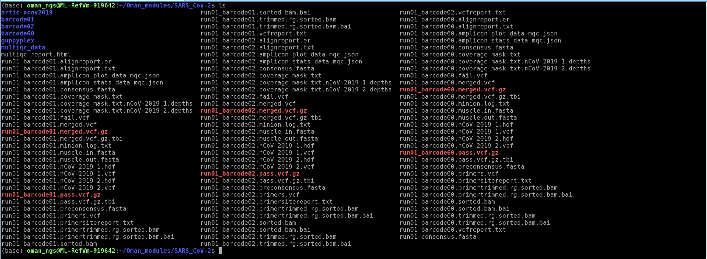

Recall the output files from the ARTIC pipeline we ran last module. We are particularly interested in the consensus genome files produced. You can see those files specifically by using the `*` trick like so :

```bash
ls *.consensus.fasta
```


Then we can combine these files together using `cat`:
```bash
cat *.consensus.fasta > all.consensus.fasta
```

We can check how many entries are in a fasta file by using `grep`

**!!! It is very important to remember the `">"` in this command !!!**  
This is because `>` is the redirect output symbol for creating a new file. If we forget to quotes then we will overwrite our file! `">"` versus `>`!!
```bash
grep -c ">" all.consensus.fasta
```
`-c` = count the number of matches  
Here we are searching for matches to `>`, which is at the start of every fasta entry  

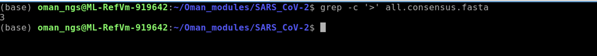


## 1. Running Pangolin<a name="exercise1"></a>

Pangolin has become the default tool for assigning lineages for SARS-CoV-2. You can learn more about the actual tool from the website:  
<https://cov-lineages.org/resources/pangolin.html>

#### First we install `pangolin` using `mamba`:

```bash
mamba create --name pango
mamba activate pango
mamba install -c conda-forge -c bioconda -c defaults pangolin
```

Check that the installation worked:
```bash
pangolin -v
pangolin -pv
```
As new lineages and variants arise, pangolin must be updated regularly. To update run:
```bash
pangolin --update
```


#### Run `pangolin` on our consensus genomes:
```bash
pangolin all.consensus.fasta
```
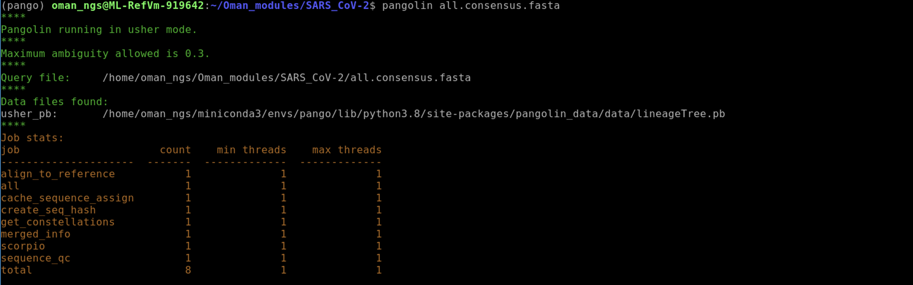

The output file created by `pangolin` is called `lineage_report.csv`.

You can view it using `less`:
```bash
less lineage_report.csv
```
To exit `less` type `q` when you are finished reading.

The descriptions of the output can be found here: <https://cov-lineages.org/resources/pangolin/output.html>

As there are many columns in the `lineage_report.csv` file it is hard to interpret the file using the `less` command. We can use a few tricks to help us see the output more clearly:

Recall that we can link commands together using a pipe `|`

```bash
cat lineage_report.csv | cut -d, -f1-3,5,14 | column -t -s ","
```
1. `cat` : prints file to the screen  
2. `cut`: command used to select which columns. `-d` sets the delimiter. In our case it is a `,`. `-f` sets the column numbers we wish to keep. Here we select 1 through 3,5, and 14.
3. `column` used so that it prints the output nicely aligned. `-t` means tab separate. `-s` sets the delimiter. Here again we set this as `","`

You can try these commands one at a time and see what the output is doing at each step.  
**Much better!**
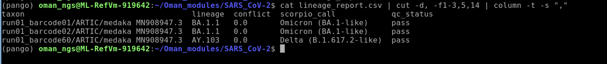

Of course, you can also read the `lineage_report.csv` into Excel or the equivalent in Linux, which is LibreOffice Calc.
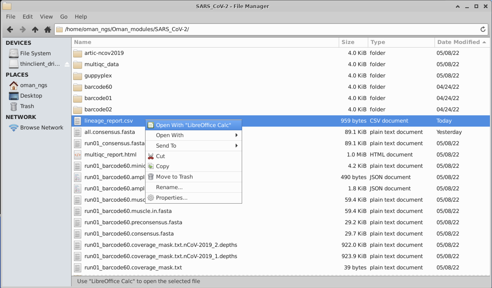

We have a comma separated file, so set the import options accordingly:
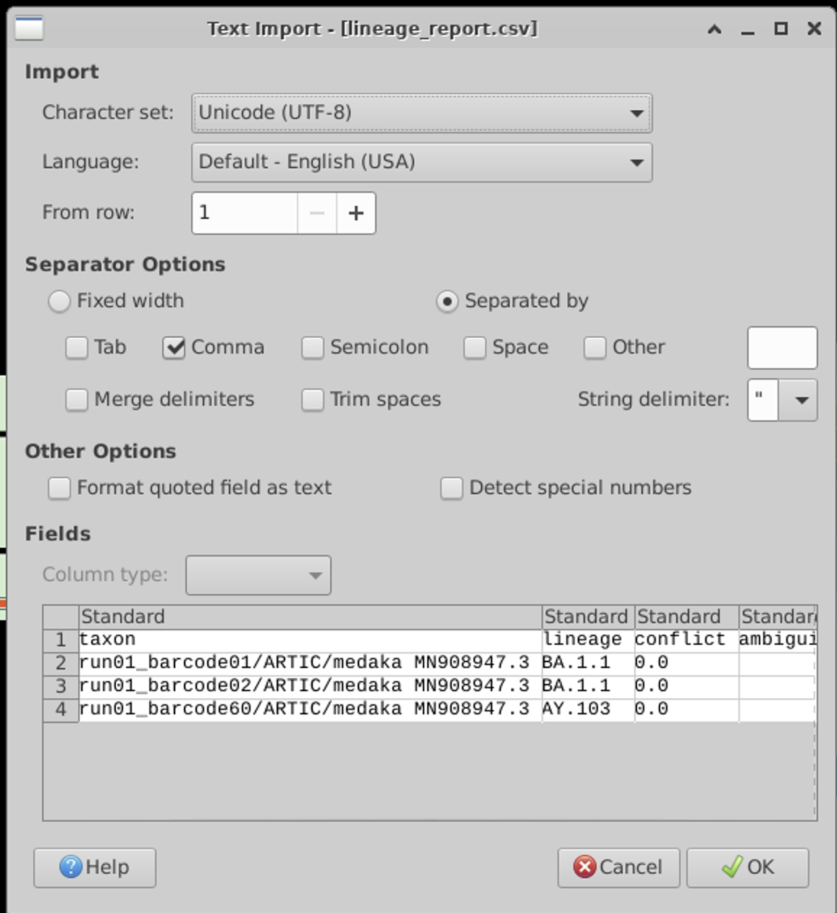

## 2. Running NextClade<a name="exercise2"></a>

NextClade is another popular tool for lineage calling and QC. In fact, we used the web-based version of NextClade in our first module, if you remember: <https://domman-genomics.github.io/Oman_NGS/manuals/01_Intro_to_NGS/module_Intro.html>

Here we are going to use the command-line version.
You can learn more about the tool here: <https://docs.nextstrain.org/projects/nextclade/en/stable/user/nextclade-cli.html>

### Install `NextClade` using `mamba`:
```bash
mamba install -c bioconda nextclade
```
We can install NextClade directly in our `pango` conda envirionment. These tools play nice with each other!  

We can check it installed correctly and learn how to use the tool:
```bash
nextclade --help
```
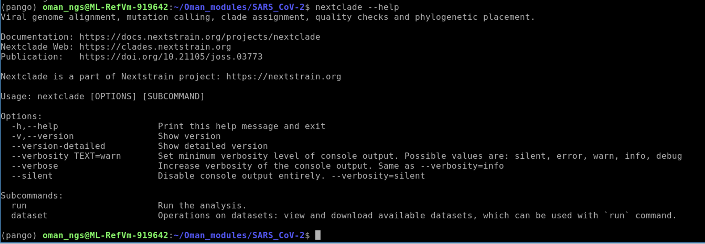

### Download the NextClade SARS-CoV-2 dataset
```bash
nextclade dataset get --name 'sars-cov-2' --output-dir 'data/sars-cov-2'
```

### Now we are ready to run the analysis:
```bash
nextclade \
   --in-order \
   --input-fasta all.consensus.fasta \
   --input-dataset data/sars-cov-2 \
   --output-tsv output/nextclade.tsv \
   --output-tree output/nextclade.auspice.json \
   --output-dir output/ \
   --output-basename nextclade
```

The `--input-fasta` flag is where we specify our input fasta file. We do not need to change the other options.

The output of the command we specified will be placed in a new folder called `output`, using the `--output-dir` flag.

### Viewing the results of NextClade
I think it is easiest to view this using Excel or equivalent. Open it as we did the pango results.
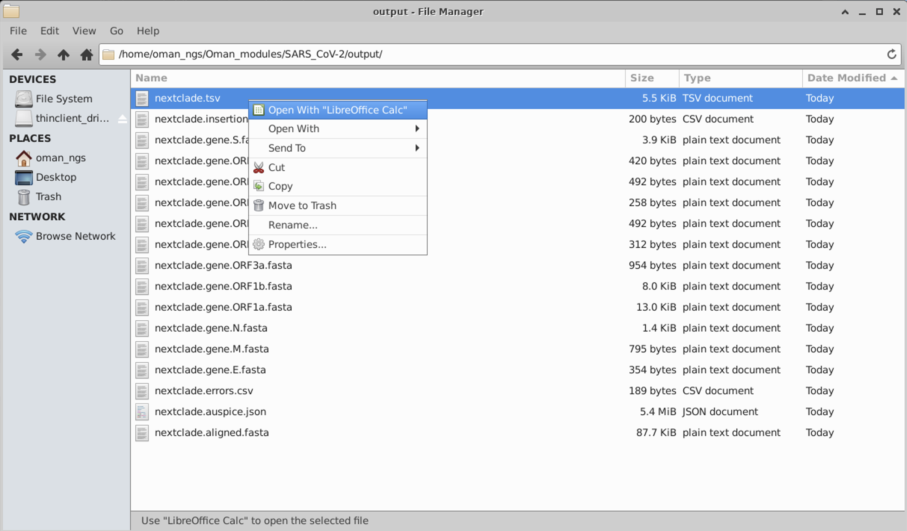

This is a tab separated file:
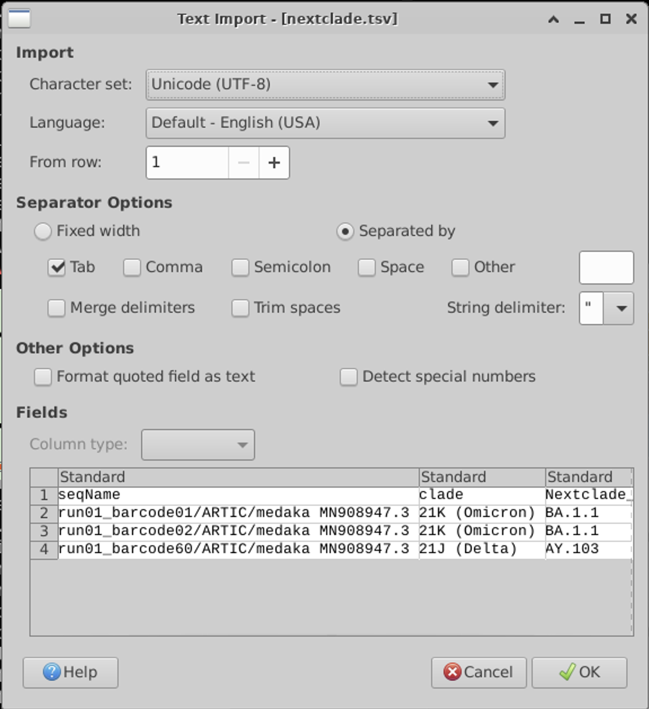

There are quote a few output columns. You can see all of the output descriptions from the website:
<https://docs.nextstrain.org/projects/nextclade/en/stable/user/output-files.html>

But here are a few important ones:  

| Column name                                     | Meaning                                                                                                    |
| ----------------------------------------------- | ---------------------------------------------------------------------------------------------------------- |
| seqName                                         | Name of the sequence (as provided in the input file)                                                       |
| clade                                           | Assigned clade                                                                                             |
| qc.overallScore                                 | Overall [quality control](algorithm/07-quality-control.html) score                                         |
| qc.overallStatus                                | Overall [quality control](algorithm/07-quality-control.html) status                                        |
| totalSubstitutions                              | Total number of detected nucleotide substitutions                                                          |
| totalDeletions                                  | Total number of detected nucleotide deletions                                                              |
| totalInsertions                                 | Total number of detected nucleotide insertions                                                             |
| totalAminoacidSubstitutions                     | Total number of detected aminoacid substitutions                                                           |
| totalAminoacidDeletions                         | Total number of detected aminoacid deletions                                                               |
| totalMissing                                    | Total number of detected missing nucleotides                                                               |
| totalNonACGTNs                                  | Total number of detected ambiguous nucleotides                                                             |
| totalPcrPrimerChanges                           | Total number of nucleotide mutations detected in PCR primer regions                                        |
| substitutions                                   | List of detected nucleotide substitutions                                                                  |
| deletions                                       | List of detected nucleotide deletion ranges                                                                |
| insertions                                      | List of detected inserted nucleotide fragments                                                             |


## 3. Align sequences using `mafft`<a name="exercise3"></a>
The next step is to place our sequences within context of other globally representative strains. But before we can create a phylogeny, we have to ensure our sequences are aligned. We will be using the `mafft` aligner for this.

We will also download a tool that allows you to visualize our sequence and alignment data.

#### Install `jalview`
```bash
mamba install -c conda-forge -c bioconda jalview
```

First lets copy over the representative set from the NextClade data folder we downloaded earlier:
```bash
cp data/sars-cov-2/sequences.fasta .
```

Now we need to add our samples to this set. Let's use the `cat` command to merge these two files.
```bash
cat all.consensus.fasta sequences.fasta > combined_seqs.fasta
```
Use `grep` to count how many sequences we have total in the alignment now:
```bash
grep -c '>' combined_seqs.fasta
```

Now we align the sequences with `mafft` like so:
```bash
mafft --thread 4 combined_seqs.fasta > combined_seqs_ALN.fasta
```
`mafft [options] in_file > out_file`  
`--thread` : number of CPUs to use (we have 4 on the VM)

We can look at the alignment using `jalview`:
```bash
jalview -open combined_seqs_ALN.fasta
```
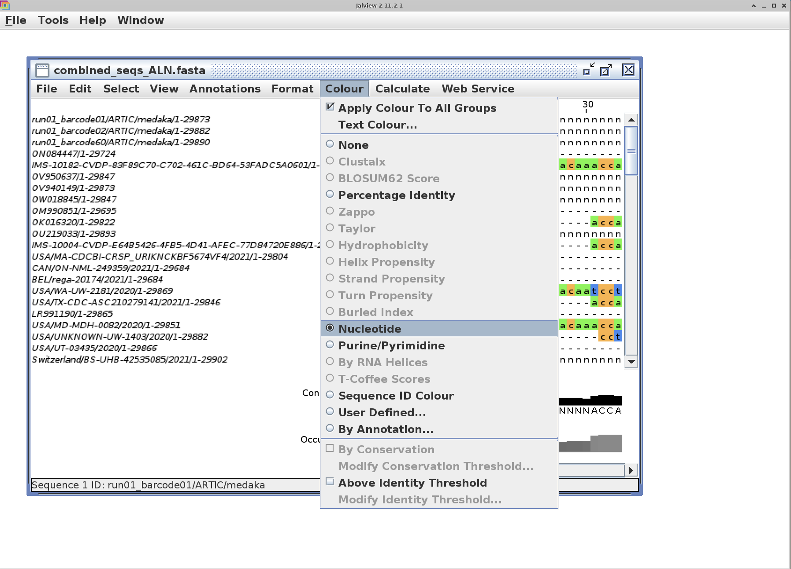

I find that turning on the color option to "Nucleotide" makes the alignment much easier to view.

## 4. Phylogeny using IQ-Tree<a name="exercise4"></a>
There are many different programs used for creating phylogenies:
1. RAxML
2. IQ-Tree
3. PhyML
5. FastTree
6. BEAST
7. PhyloBayes

Today we will use a widely popular one called IQ-Tree.
You can find more information about the programs and it's many options here:
<http://www.iqtree.org>

First we need to install `iqtree`:
```bash
mamba install -c conda-forge -c bioconda iqtree
```

We can create a phylogeny using this command:
```bash
iqtree -s combined_seqs_ALN.fasta -m GTR -T AUTO -B 1000
```
`-s`: input sequence alignment  
`-m` : model of evolution. The general time reversible model (GTR) is usually a good choice.  
`-T` : number of CPUs. IQ-Tree can auto find the optimal number with AUTO  
`-B`: number of rapid bootstraps to assess statistical confidence in branch support

There are several outputs from iqtree:  
`.iqtree` : the main report file that is self-readable. You should look at this file to see the computational results.   
`.treefile` : the ML tree in NEWICK format, which can be visualized by FigTree or iTOL  
`.log`: log file of the entire run

We need to install `figtree` to view the phylogeny.
```bash
mamba install -c conda-forge -c bioconda figtree
```
Once installed lauch `figree` to view out tree:
```bash
figtree combined_seqs_ALN.fasta.treefile
```
Click `OK` when the popup menu appears.

We can then re-root the tree like so for better viewing by selecting Midpoint root in the left hand menu:
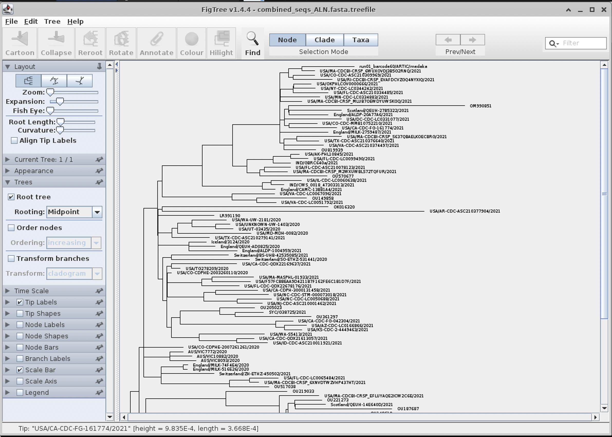
